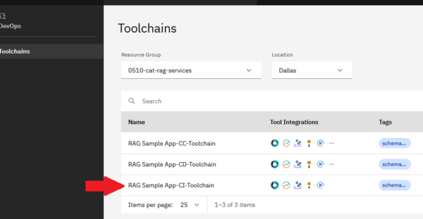
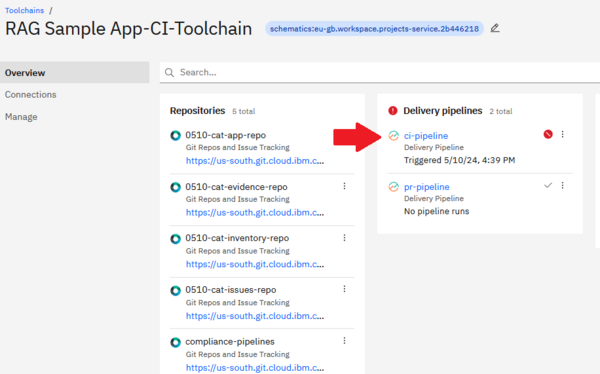
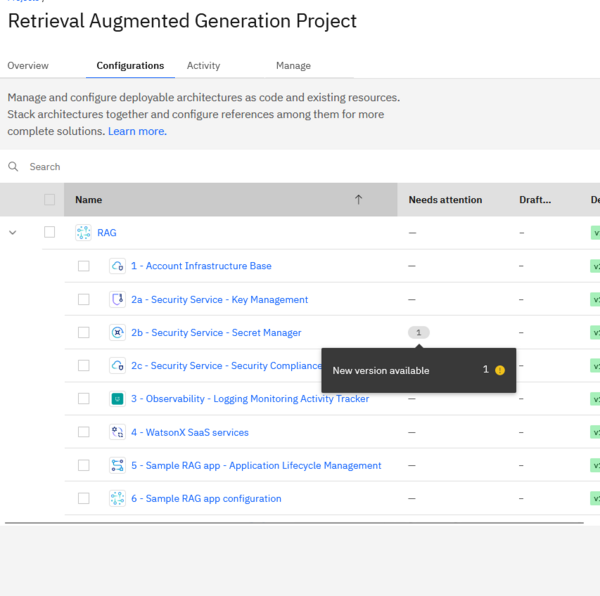
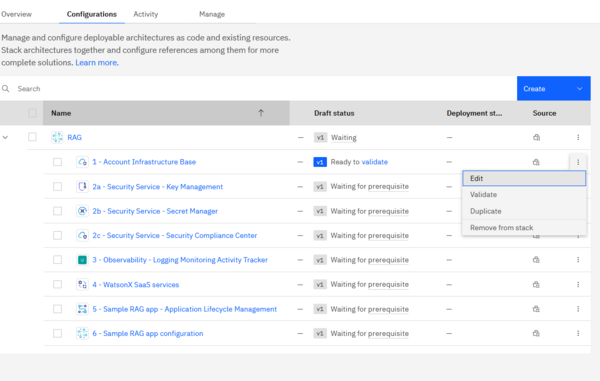
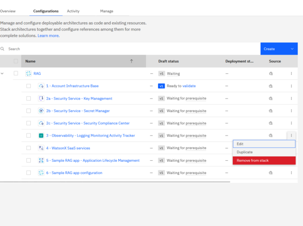
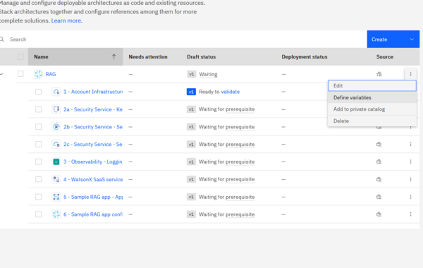
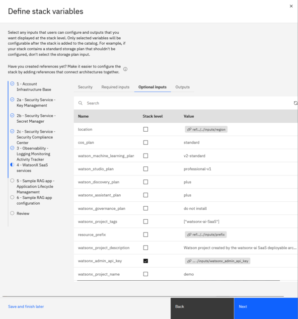

# Retrieval Augmented Generation Pattern for Watsonx on IBM Cloud

The following [deployable architecture](https://cloud.ibm.com/docs/secure-enterprise?topic=secure-enterprise-understand-module-da#what-is-da) automates the deployment of a sample GenAI Pattern on IBM Cloud, including all underlying IBM Cloud infrastructure. This architecture implements the best practices for Watsonx GenAI Pattern deployment on IBM Cloud, as described in the [reference architecture](https://cloud.ibm.com/docs/pattern-genai-rag?topic=pattern-genai-rag-genai-pattern).

This deployable architecture provides a comprehensive foundation for trust, observability, security, and regulatory compliance by configuring the IBM Cloud account to align with compliance settings, deploying key and secret management services, and deploying the infrastructure to support CI/CD/CC pipelines for secure application lifecycle management. These pipelines facilitate the deployment of the application, vulnerability checks, and auditability, ensuring a secure and trustworthy deployment of Generative AI applications on IBM Cloud.

# Objective and Benefits

This deployable architecture is designed to showcase a fully automated deployment of a retrieval augmented generation application through IBM Cloud Project, providing a flexible and customizable foundation for your own Watson-based application deployments on IBM Cloud. This architecture deploys the following [sample application](https://github.com/IBM/gen-ai-rag-watsonx-sample-application) by default.

By leveraging this architecture, you can accelerate your deployment and tailor it to meet your unique business needs and enterprise goals.

By using this architecture, you can:

* Establish Trust: The architecture ensures trust by configuring the IBM Cloud account to align with compliance settings as defined in the [Financial Services](https://cloud.ibm.com/docs/framework-financial-services?topic=framework-financial-services-about) framework.
* Ensure Observability: The architecture provides observability by deploying services such as IBM Log Analysis, IBM Monitoring, IBM Activity Tracker, and log retention through Cloud Object Storage buckets.
* Implement Security: The architecture ensures security by deploying IBM Key Protect and IBM Secrets Manager.
* Achieve Regulatory Compliance: The architecture ensures regulatory compliance by implementing CI/CD/CC pipelines, along with IBM Security Compliance Center (SCC) for secure application lifecycle management.


# Deployment Details

To deploy this architecture, follow these steps.

## 1. Prerequisites

Before deploying the deployable architecture, ensure you have:

* Created an API key in the target account with sufficient permissions. The target account is the account that will be hosting the resources deployed by this deployable architecture. See [instructions](https://cloud.ibm.com/docs/account?topic=account-userapikey&interface=ui) Note the API key, as it will be used later. On evaluation environments, you may simply grant `Administrator` role on `IAM Identity Service`, `All Identity and Access enabled services` and `All Account Management` services. If you need to narrow down further access, for a production environment for instance, the minimum level of permissions is indicated in the [Permission tab](https://cloud.ibm.com/catalog/7a4d68b4-cf8b-40cd-a3d1-f49aff526eb3/architecture/Retrieval_Augmented_Generation_Pattern-5fdd0045-30fc-4013-a8bc-6db9d5447a52-global#permissions) of the deployable architecture.
* (Recommended to ensure successful sample app deployment) Created or have access to a signing key, which is the base64 key obtained from `gpg --gen-key` (if not generated before or expired) and then exported via `gpg --export-secret-key <Email Address> | base64` command. See the [devsecops image signing page](https://cloud.ibm.com/docs/devsecops?topic=devsecops-devsecops-image-signing#cd-devsecops-gpg-export) for details. Keep note of the key for later. The signing key is not required to deploy all of the Cloud resources created by this deployable architecture, but is necessary to get the automation to build and deploy the sample application.
* (Optional) Installed the IBM Cloud CLI's Project add-on using the `ibmcloud plugin install project` command. More information is available [here](https://cloud.ibm.com/docs/cli?topic=cli-projects-cli).

Ensure that you are familiar with the "Important Deployment Considerations" located at the bottom of this document.

## 2. Deploy the Stack in a New Project from Catalog

* Locate the [tile](https://cloud.ibm.com/catalog/7a4d68b4-cf8b-40cd-a3d1-f49aff526eb3/architecture/Retrieval_Augmented_Generation_Pattern-5fdd0045-30fc-4013-a8bc-6db9d5447a52-global) for the Deployable Architecture in the IBM Cloud Catalog.
* Click the "Add to project" button.

    

* Select **Create new** and enter the following details:
   - Name and Description (e.g., "Retrieval Augmented Generation Pattern")
   - Region and Resource Group for the project. e.g. for evaluation purposes, you may select the region the closest to you, and the Default resource group. For more insights on the recommended production topology, refer to the Enterprise account architecture Central administration account [white paper](https://cloud.ibm.com/docs/enterprise-account-architecture?topic=enterprise-account-architecture-admin-hub-account).
   - Configuration Name (name of the automation in the project, e.g., "RAG", "dev" or "prod", ideally matching the deployment target, but this can be any name)

        

* Click the **Add** button (or **Create** if this is the first project in the account) at the bottom right of the modal popup to complete.

## 3. Set the Input Configuration for the Stack

After completing `Step 2 - Deploy the Stack in a New Project from Catalog`, you are directed to a page allowing you to enter the configuration for you deployment:
* Under Security -> Authentication, enter the API Key from the prereqs in the `api_key` field.
  
* Under Required, input a prefix. This prefix will be appended to the name of most resources created by automation, ensuring uniqueness and avoiding clashes when provisioning names in the same account.
* Under Optional, input the signing_key field. While not necessary for deploying Cloud resources, it is recommended and required to enable the building and deployment of the sample app.

You may explore the other available inputs, such as the region and resource group name (under optional tab), leave them as is, or modify them as needed.

Once ready, click the "Save" button at the top of the screen.

## 4. Deploy the Architecture

Navigate to the project deployment view by clicking the project name in the breadcrumb menu.


You should be directed to a screen looking like:


Two approaches to deploy the architecture:
1. Through the UI
2. Automated - `./deploy-many.sh` is provided.

### Approach 1: Deployment through the UI

1. Click on validate

    

2. Wait for validation

    

3. Approve and click the deploy button

    

4. Wait for deployment

5. Repeat step 1 for the next configuration in the architecture. Note that as you progress in deploying the initial base configuration, you will be given the option to validate and deploy multiple configuration in parallel.

### Approach 2: Run ./deploy-many.sh

* Clone the repository at https://github.com/terraform-ibm-modules/stack-retrieval-augmented-generation/tree/main
* Ensure you are logged in to the account containing the Cloud project with the stack using `ibmcloud login`.
* Execute `./deploy-many.sh` with the project name, stack name, and optional configuration name pattern.

Example - Process all configurations in the project:
```bash
./deploy-many.sh my-test-project dev
```

Tips: If deployment fail for one of the configuration, you may re-run the script as is. It will skip existing installed configurations and continue where it last failed.

## 5. Post deployment steps

At this point, the infrastructure has been successfully deployed in the target account, and the initial build of the sample application has started in the newly-provisioned DevOps service.

### Monitoring the Build and Deployment

To monitor the build and deployment of the application, follow these steps:
1. **Access the DevOps Toolchains View**: Navigate to the [DevOps / Toolchains view](https://cloud.ibm.com/devops/toolchains) in the target account.
2. **Select the Resource Group and Region**: Choose the resource group and region where the infrastructure was deployed. The resource group name is based on the prefix and resource_group_name inputs of the deployable architecture.
3. **Select the Toolchain**: Select "RAG Sample App-CI-Toolchain"
    
4. **Access the Delivery Pipeline**: In the toolchain view, select ci-pipeline under Delivery pipeline
    
5. **View the CI Pipeline Status**: The current status of the CI pipeline execution can be found under the "rag-webhook-trigger" section.

### Verifying the Application Deployment

Once the initial run of the CI pipeline complete, you should be able to view the application running in the created [Code Engine project](https://cloud.ibm.com/codeengine/projects).


### Enabling Watson Assistant

After the application has been built and is running in Code Engine, there are additional steps specific to the sample app that need to be completed to fully enable Watson Assistant in the app. To complete the installation, follow the steps outlined in the [application README.md file](https://github.com/IBM/gen-ai-rag-watsonx-sample-application/blob/main/artifacts/artifacts-README.md).


## 6. Important Deployment Considerations

### API Key Requirements

The deployable architecture can only be deployed with an API Key associated with a user. It is not compatible with API Keys associated with a serviceId. Additionally, it cannot be deployed using the Project trusted profile support.

### Known UI Issue: "Unable to validate your configuration"

After approving the configuration, you may encounter an error message stating "Unable to validate your configuration". This is a known UI issue that can be resolved by simply **refreshing your browser window**. This will allow you to continue with the deployment process.

### Using the ./deploy-many.sh Script

The provided `deploy-many.sh` script is designed to deploy the stack of configurations as provided out of the box, and when following the instructions in this page. However, if you:
- Modify the stack definition in your project (beyond specifying inputs at the stack level)
- Or, deploy the stack in an existing project

Use the **Project UI** to deploy; do not use the script.

### Notification of New Configuration Versions ("Needs Attention")

You may see notifications in IBM Cloud Project indicating that one or more configurations in the stack have new versions available. You can safely ignore these messages at this point, as they will not prevent you from deploying the stack. No specific action is required from you.



Please note that these notifications are expected, as we are rapidly iterating on the development of the underlying components. As new stack versions become available, the versions of the underlying components will also be updated accordingly.


# Customization options

There are numerous customization possibilities available out of the box. This section explores some common scenarios, but is not exhaustive.

## Editing Individual Configurations

Each configuration in the deployed stack surfaces a large number of input parameters. You can directly edit each parameter to tailor your deployment by selecting the **Edit** option in the menu for the corresponding configuration on the right-hand side.



This approach enables you to:
- Fine-tune account settings
- Deploying additional Watson components, such as Watsonx Governance
- Deploy to an existing resource group
- Reuse existing key protect keys
- Tuning the parameter of the provisioned code engine project
- ...

## Removing Configurations from the Stack

You can remove any configuration from the stack, provided there is no direct dependency in later configurations, by selecting the **Remove from Stack** option in the right-hand side menu for the corresponding configuration.

This applies to the following configurations:
- Observability
- Security and Control Center



## Managing Stack-Level Inputs and Outputs

You can add or remove inputs and outputs surfaced at the stack level by following these steps:
1. Select the stack configuration

    
1. You are presented with a screen allowing you to promote any of the configuration inputs or outputs at the stack level

    


## Sharing Modified Stacks through a Private IBM Cloud Catalog

Once you have made modifications to your stack in Project, you can share it with others through a private IBM Cloud Catalog. To do so, follow these steps:
1. Deploy the stack at least once: You need to deploy the stack first to allow importing the stack definition to a private catalog.
2. Select the "Add to private catalog" option in the menu located on the stack configuration.

This will allow you to share your modified stack with others through a private IBM Cloud Catalog.


## Customizing for Your Application

As you deploy your own application, you may want to remove the last configuration (Sample RAG app configuration), which is specific to the sample app provided out of the box. You can use the code of this sample automation as a guide to implement your own, depending on your application needs. The code is available at [https://github.com/terraform-ibm-modules/terraform-ibm-rag-sample-da](https://github.com/terraform-ibm-modules/terraform-ibm-rag-sample-da).
