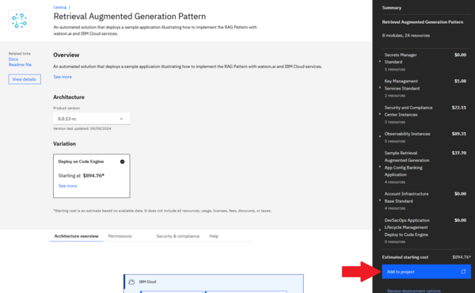
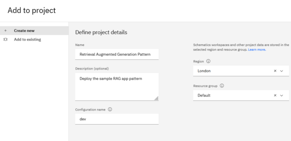
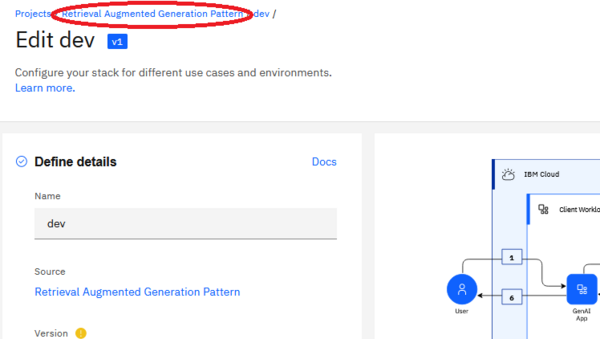
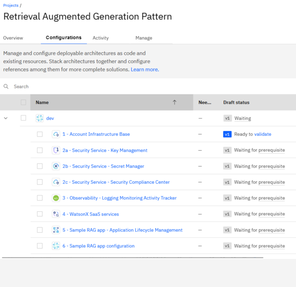
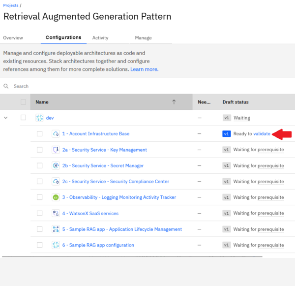
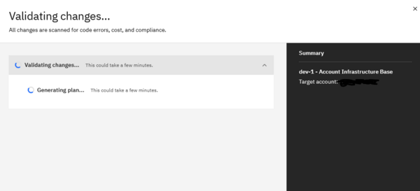
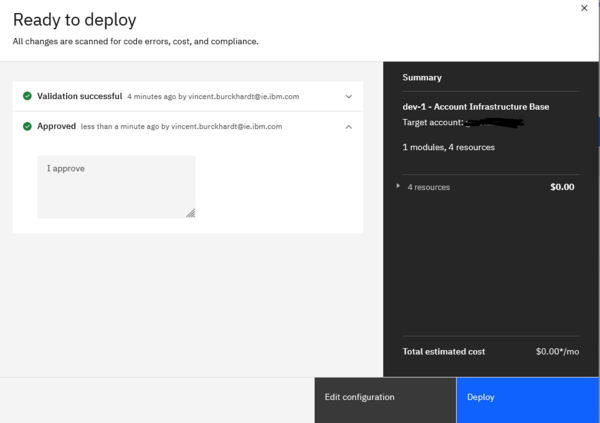

# Retrieval Augmented Generation Pattern for Watsonx on IBM Cloud

The following [deployable architecture](https://cloud.ibm.com/docs/secure-enterprise?topic=secure-enterprise-understand-module-da#what-is-da) automates the deployment of a sample GenAI Pattern on IBM Cloud, including all underlying IBM Cloud infrastructure. This architecture implements the best practices for Watsonx GenAI Pattern deployment on IBM Cloud, as described in the [reference architecture](https://cloud.ibm.com/docs/pattern-genai-rag?topic=pattern-genai-rag-genai-pattern).

This deployable architecture provides a comprehensive foundation for trust, observability, security, and regulatory compliance by configuring the IBM Cloud account to align with compliance settings, deploying key and secret management services, and deploying the infrastructure to support CI/CD/CC pipelines for secure application lifecycle management. These pipelines facilitate the deployment of the application, vulnerability checks, and auditability, ensuring a secure and trustworthy deployment of Generative AI applications on IBM Cloud.

# Objective and Benefits

This deployable architecture is designed to showcase a fully automated deployment of a retrieval augmented generation application through IBM Cloud Project, providing a flexible and customizable foundation for your own Watson-based application deployments on IBM Cloud. This architecture deploys the following [sample application](https://github.com/IBM/gen-ai-rag-watsonx-sample-application) by default.

By leveraging this architecture, you can accelerate your deployment and tailor it to meet your unique business needs and enterprise goals.

By using this architecture, you can:

* Establish Trust: The architecture ensures trust by configuring the IBM Cloud account to align with compliance settings as defined in the [Financial Services](https://cloud.ibm.com/docs/framework-financial-services?topic=framework-financial-services-about) framework.
* Ensure Observability: The architecture provides observability by deploying services such as IBM Log Analysis, IBM Monitoring, IBM Activity Tracker, and log retention through Cloud Object Storage buckets.
* Implement Security: The architecture ensures security by deploying IBM Key Protect and IBM Secrets Manager.
* Achieve Regulatory Compliance: The architecture ensures regulatory compliance by implementing CI/CD/CC pipelines, along with IBM Security Compliance Center (SCC) for secure application lifecycle management.


# Deployment Details

To deploy this architecture, follow these steps.

## 1. Prerequisites in Target Account

Before deploying the deployable architecture, ensure you have:

* Created an API key in the target account with sufficient permissions. See [instructions](https://cloud.ibm.com/docs/account?topic=account-userapikey&interface=ui) Note the API key, as it will be used later. On evaluation environments, you may simply grant `Administrator` role on `IAM Identity Service`, `All Identity and Access enabled services` and `All Account Management` services. If you need to narrow down further access, for a production environment for instance, the minimum level of permissions is indicated in the [Permission tab](https://cloud.ibm.com/catalog/7df1e4ca-d54c-4fd0-82ce-3d13247308cd/architecture/Retrieval_Augmented_Generation_Pattern-5fdd0045-30fc-4013-a8bc-6db9d5447a52?kind=terraform&format=stack&version=32db3936-66fe-4b04-bbc8-61d5676a89f1#permissions) of the deployable architecture.
* A signing key, which is the base64 key obtained from `gpg --gen-key` (if not generated before or expired) and then exported via `gpg --export-secret-key <Email Address> | base64` command. See the [devsecops image signing page](https://cloud.ibm.com/docs/devsecops?topic=devsecops-devsecops-image-signing#cd-devsecops-gpg-export) for details. Key note of the key for later.
* (Optional) Installed the IBM Cloud CLI's Project add-on using the `ibmcloud plugin install project` command. More information is available [here](https://cloud.ibm.com/docs/cli?topic=cli-projects-cli).

## 2. Deploy the Stack in a New Project from Catalog

* Locate the [tile](https://cloud.ibm.com/catalog/7df1e4ca-d54c-4fd0-82ce-3d13247308cd/architecture/Retrieval_Augmented_Generation_Pattern-5fdd0045-30fc-4013-a8bc-6db9d5447a52) for the Deployable Architecture in the IBM Cloud Catalog.
* Click the "Add to project" button.

    

* Select "Create new" and input IBM Cloud Project details.
   - Name and description. eg: "Retrieval Augmented Generation Pattern"
   - Region and resource group for the project. Note that this is the region and resource group where the runtime (IBM Cloud Schematics) executiong the automation code is located. You can still deploy the resources to any region, any resource group, and any account.
   - Configuration name - for example: "dev" or "prod".

        

* Click "Add" to complete.

## 3. Set the Input Configuration for the Stack

After completing `Step 2 - Deploy the Stack in a New Project from Catalog`, you are directed to a page allowing you to enter the configuration for you deployment:
* Under Security -> Authentication, enter the API Key from the prereqs in the `api_key` field.
* Under Requires, input the signing key in the `signing_key` field.

You may explore the other available inputs, such as the region and resource group name (under optional tab), leave them as is, or modify them as needed.


Once ready, click the "Save" button at the top of the screen.

## 4. Deploy the Architecture

Navigate to the project deployment view by clicking the project name in the breadcrumb menu.




You should be directed to a screen looking like:



Two approaches to deploy the architecture:
1. Through the UI - note that using the UI requires a large number of clicks each elements on the architecture stack.
2. Automated - se the  script `./deploy-many.sh` is provided.

### Approach 1: Deployment through the UI

1. Click on validate

    

2. Wait for validation

    

3. Approve and click the deploy button

    

4. Wait for deployment

5. Repeat step 1 for the next configuration in the architecture.

### Approach 2: Run ./deploy-many.sh

* Clone the repository at https://github.com/terraform-ibm-modules/stack-retrieval-augmented-generation/tree/main
* Ensure you are logged in to the account containing the Cloud project with the stack using `ibmcloud login`.
* Execute `./deploy-many.sh` with the project name, stack name, and optional configuration name pattern. The selected non-stack configurations will be processed by their name in alphabetical order. Using the configuration name pattern (regex can be used - make sure to enclose it in quotes), you can choose which configurations are deployed.

Example 1 - Update stack inputs for stack configuration `dev` and process all non-stack configurations in the project:
```bash
./deploy-many.sh my-test-project dev
```

Example 2 - Update stack inputs and process some configurations in the project:
```bash
./deploy-many.sh my-test-project dev 'RAG-1|RAG-4|RAG-5'
```

Example 3 - Simulate updating stack inputs and validating some configurations in the project in dry-run mode (no changes or actual validation or deployments are done):
```bash
DRY_RUN=true ./deploy-many.sh my-test-project dev 'RAG-1|RAG-4|RAG-5'
```

Tips: If deployment fail for one of the configuration, you may re-run the script as is. It will skip existing installed configurations and continue where it last failed.

## 5. Post deployment steps

At this point, all of the infrastructure is deployed in the target account. The initial build for the sample app has also started in the DevOps service, and the app is deployed to IBM Cloud Code Engine.

There are some remaining steps, specific to the sample app, that can be completed to fully enable Watson assistant in the app. To complete the installation - follow the steps at https://github.com/IBM/gen-ai-rag-watsonx-sample-application/blob/main/artifacts/artifacts-README.md

# Stack Deployment Script
This script is used to validate, approve, and deploy configurations for a project in IBM Cloud. It can also undeploy configurations if needed.

### Prerequisites
 - Python 3
 - IBM Cloud CLI
 - IBM Cloud Project plugin

### Usage
Clone the repository and navigate to the directory containing the script.

Set the necessary environment variables:
```export IBMCLOUD_API_KEY=<your_ibmcloud_api_key>```
Run the script:
```python stackDeploy.py --project_name <project_name> --stack_name <stack_name> --config_order <config_order>```
Replace <project_name>, <stack_name>, and <config_order> with your specific values.

The script will deploy the configurations in the order specified in the config_order argument. The script will attempt to deploy the configurations in parallel if possible.

### Undeploy
To undeploy a stack, run the script with the `--undeploy` flag:
```python stackDeploy.py --project_name <project_name> --stack_name <stack_name> --config_order <config_order> --undeploy```
The script will undeploy in reverse order of the config_order argument sequentially, as the reverse order is the safest way to undeploy configurations.

### Arguments
Arguments will take precedence over settings in the config file.
 - `-p <PROJECT_NAME>, --project_name <PROJECT_NAME>`: The project name (can be set in the config file)
 - `-s <STACK_NAME>, --stack_name <STACK_NAME>`: The stack name (can be set in the config file)
 - `-o <CONFIG_ORDER>, --config_order <CONFIG_ORDER>`: The config names in order to be deployed in the format "config1|config2|config3" (can be set in the config file)
 - `--stack_def_path <STACK_DEF_PATH>`: The path to the stack definition json file (can be set in the config file)
 - `--stack_inputs <STACK_INPUTS>`: Stack inputs as json string {"inputs":{"input1":"value1", "input2":"value2"}} (can be set in the config file)
 - `--stack_api_key_env <STACK_API_KEY_ENV>`: The environment variable name for the stack api key to deploy with (can be set in the config file)
 - `-c <CONFIG_JSON_PATH>, --config_json_path <CONFIG_JSON_PATH>`: The path to the config json file
 - `--skip_stack_inputs`: Skip setting stack inputs
 - `-u, --undeploy`: Undeploy the stack
 - `--debug`: Enable debug mode
 - `--help`: Show help message

### Sample Config File
```json
{
    "project_name": "my_project",
    "stack_name": "my_stack",
    "config_order": [
        "config1",
        "config2",
        "config3"],
    "stack_def_path": "stack_definition.json",
    "stack_inputs": {
        "input1":"value1",
        "input2":"value2",
        "ibmcloud_api_key": "API_KEY"
    },
    "api_key_env_var": "IBMCLOUD_API_KEY"
}
```
- `project_name`: The name of your project.
- `stack_name`: The name of your stack.
- `config_order`: An array of configuration names in the order they should be deployed.
- `stack_def_path`: The path to the stack definition JSON file.
- `stack_inputs`: A dictionary of stack inputs. NOTE: if a key is set to `API_KEY` it will be replaced with the value of the `stack_api_key_env` environment variable.
- `config_json_path`: The path to the configuration JSON file.
- `stack_api_key_env`: The environment variable name for the stack API key to deploy with.


### Troubleshooting
If you encounter any errors, check the logs for detailed error messages. If the error is related to a specific configuration, the error message will include the configuration ID.
The debug flag can be used to print additional information to the console.
