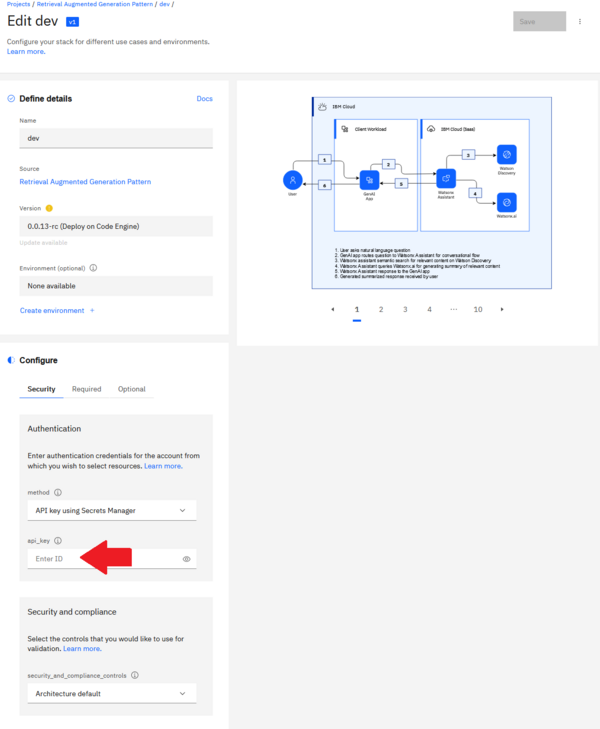

# Retrieval Augmented Generation Pattern for Watsonx on IBM Cloud

The following [deployable architecture](https://cloud.ibm.com/docs/secure-enterprise?topic=secure-enterprise-understand-module-da#what-is-da) automates the deployment of a sample GenAI Pattern on IBM Cloud, including all underlying IBM Cloud infrastructure. This architecture implements the best practices for Watsonx GenAI Pattern deployment on IBM Cloud, as described in the [reference architecture](https://cloud.ibm.com/docs/pattern-genai-rag?topic=pattern-genai-rag-genai-pattern).

This deployable architecture provides a comprehensive foundation for trust, observability, security, and regulatory compliance by configuring the IBM Cloud account to align with compliance settings, deploying key and secret management services, and deploying the infrastructure to support CI/CD/CC pipelines for secure application lifecycle management. These pipelines facilitate the deployment of the application, vulnerability checks, and auditability, ensuring a secure and trustworthy deployment of Generative AI applications on IBM Cloud.

# Objective and Benefits

This deployable architecture is designed to showcase a fully automated deployment of a retrieval augmented generation application through IBM Cloud Project, providing a flexible and customizable foundation for your own Watson-based application deployments on IBM Cloud. This architecture deploys the following [sample application](https://github.com/IBM/gen-ai-rag-watsonx-sample-application) by default.

By leveraging this architecture, you can accelerate your deployment and tailor it to meet your unique business needs and enterprise goals.

By using this architecture, you can:

* Establish Trust: The architecture ensures trust by configuring the IBM Cloud account to align with compliance settings as defined in the [Financial Services](https://cloud.ibm.com/docs/framework-financial-services?topic=framework-financial-services-about) framework.
* Ensure Observability: The architecture provides observability by deploying services such as IBM Log Analysis, IBM Monitoring, IBM Activity Tracker, and log retention through Cloud Object Storage buckets.
* Implement Security: The architecture ensures security by deploying IBM Key Protect and IBM Secrets Manager.
* Achieve Regulatory Compliance: The architecture ensures regulatory compliance by implementing CI/CD/CC pipelines, along with IBM Security Compliance Center (SCC) for secure application lifecycle management.


# Deployment Details

To deploy this architecture, follow these steps.

## 1. Prerequisites

Before deploying the deployable architecture, ensure you have:

* Created an API key in the target account with sufficient permissions. The target account is the account that will be hosting the resources deployed by this deployable architecture. See [instructions](https://cloud.ibm.com/docs/account?topic=account-userapikey&interface=ui) Note the API key, as it will be used later. On evaluation environments, you may simply grant `Administrator` role on `IAM Identity Service`, `All Identity and Access enabled services` and `All Account Management` services. If you need to narrow down further access, for a production environment for instance, the minimum level of permissions is indicated in the [Permission tab](https://cloud.ibm.com/catalog/7df1e4ca-d54c-4fd0-82ce-3d13247308cd/architecture/Retrieval_Augmented_Generation_Pattern-5fdd0045-30fc-4013-a8bc-6db9d5447a52?kind=terraform&format=stack&version=32db3936-66fe-4b04-bbc8-61d5676a89f1#permissions) of the deployable architecture.
* (Recommended) Created or access to a signing key, which is the base64 key obtained from `gpg --gen-key` (if not generated before or expired) and then exported via `gpg --export-secret-key <Email Address> | base64` command. See the [devsecops image signing page](https://cloud.ibm.com/docs/devsecops?topic=devsecops-devsecops-image-signing#cd-devsecops-gpg-export) for details. Key note of the key for later. The signing key is not required to deploy all of the Cloud resources created by this deployable architecture, but is necessary to get the automation to build and deploy the sample application.
* (Optional) Installed the IBM Cloud CLI's Project add-on using the `ibmcloud plugin install project` command. More information is available [here](https://cloud.ibm.com/docs/cli?topic=cli-projects-cli).

## 2. Deploy the Stack in a New Project from Catalog

* Locate the [tile](https://cloud.ibm.com/catalog/7a4d68b4-cf8b-40cd-a3d1-f49aff526eb3/architecture/Retrieval_Augmented_Generation_Pattern-5fdd0045-30fc-4013-a8bc-6db9d5447a52-global) for the Deployable Architecture in the IBM Cloud Catalog.
* Click the "Add to project" button.

    

* Select "Create new" and input IBM Cloud Project details.
   - Name and description. eg: "Retrieval Augmented Generation Pattern"
   - Region and resource group for the project. Note that this is the region and resource group where the runtime (IBM Cloud Schematics) executiong the automation code is located. You can still deploy the resources to any region, any resource group, and any account.
   - Configuration name - for example: "dev" or "prod".

        

* Click "Add" to complete.

## 3. Set the Input Configuration for the Stack

After completing `Step 2 - Deploy the Stack in a New Project from Catalog`, you are directed to a page allowing you to enter the configuration for you deployment:
* Under Security -> Authentication, enter the API Key from the prereqs in the `api_key` field.
* Under Required, input the signing key
* Under Optional, input `signing_key` field. This is recommended by not necessary to be able to deploy the Cloud resources. It is necessary to enable the building and deployment of the sample app however.

You may explore the other available inputs, such as the region and resource group name (under optional tab), leave them as is, or modify them as needed.



Once ready, click the "Save" button at the top of the screen.

## 4. Deploy the Architecture

Navigate to the project deployment view by clicking the project name in the breadcrumb menu.


You should be directed to a screen looking like:


Two approaches to deploy the architecture:
1. Through the UI - note that using the UI requires a large number of clicks each elements on the architecture stack.
2. Automated - se the  script `./deploy-many.sh` is provided.

### Approach 1: Deployment through the UI

1. Click on validate

    

2. Wait for validation

    

3. Approve and click the deploy button

    

4. Wait for deployment

5. Repeat step 1 for the next configuration in the architecture.

### Approach 2: Run ./deploy-many.sh

* Clone the repository at https://github.com/terraform-ibm-modules/stack-retrieval-augmented-generation/tree/main
* Ensure you are logged in to the account containing the Cloud project with the stack using `ibmcloud login`.
* Execute `./deploy-many.sh` with the project name, stack name, and optional configuration name pattern.

Example - Process all configurations in the project:
```bash
./deploy-many.sh my-test-project dev
```

Tips: If deployment fail for one of the configuration, you may re-run the script as is. It will skip existing installed configurations and continue where it last failed.

## 5. Post deployment steps

At this point, all of the infrastructure is deployed in the target account. The initial build for the sample app has also started in the DevOps service, and the app is deployed to IBM Cloud Code Engine.

There are some remaining steps, specific to the sample app, that can be completed to fully enable Watson assistant in the app. To complete the installation - follow the steps at https://github.com/IBM/gen-ai-rag-watsonx-sample-application/blob/main/artifacts/artifacts-README.md
